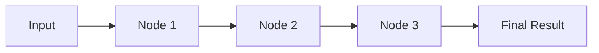
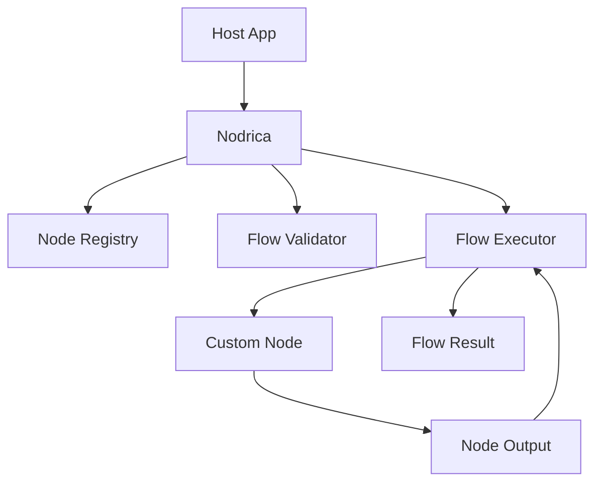
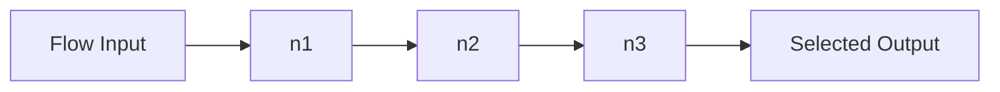
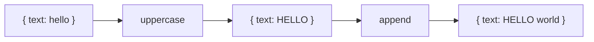
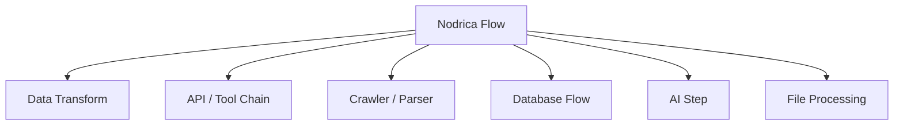
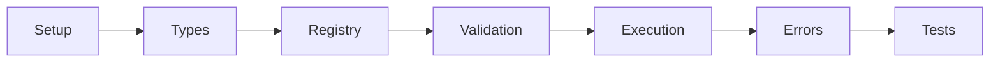

# Nodrica

A lightweight TypeScript package for running custom node-based flows inside any app.

```text
Define nodes. Connect them. Run the flow. Return the result.
```



## What It Is

Nodrica is a generic node orchestration package.

It does not know what your nodes do. It only manages:

- node registration
- flow validation
- execution order
- input/output passing
- state tracking
- final result building

Read more: [Project Reference](docs/PROJECT_REFERENCE.md)

## Core Idea



The host app provides the real node behavior:

```text
DB node
API node
crawler node
AI node
file node
custom function node
```

Read more: [Algorithm Reference](docs/ALGORITHM_REFERENCE.md)

## V1 Scope

Nodrica v1 focuses on one connected chain:



Included:

- single-node flow
- linear flow
- graph validation
- async node handlers
- selected output node
- clean validation/execution errors

Future:

- branching
- merging
- retries
- timeout
- persistence
- visual editor

Read more: [Logic Design](docs/LOGIC_DESIGN.md)

## Current Status

Implemented:

- TypeScript package skeleton
- core public `NodeFlowEngine`
- node registry
- flow validator
- linear chain executor
- node executor
- serializable errors
- v1 test suite
- typecheck/test/build validation

Pending:

- push latest code/docs to GitHub

Validation: [V1 Validation Report](docs/VALIDATION_REPORT.md)
Publishing: [Publishing Guide](docs/PUBLISHING.md)

## Example Flow

```ts
const result = await engine.run({
  input: { text: "hello" },
  nodes: [
    { id: "n1", type: "uppercase" },
    { id: "n2", type: "append", config: { value: " world" } }
  ],
  edges: [
    { from: "n1", to: "n2" }
  ],
  output: "n2"
});

console.log(result.output);
```



Read more: [API Design](docs/API_DESIGN.md)

## Common Use Cases



Examples:

```text
form input -> validate -> save to DB -> send email -> return result
file upload -> parse -> transform -> store -> notify
URL -> crawl -> extract text -> parse -> return data
prompt -> LLM call -> parse JSON -> validate -> final answer
```

Read more: [Algorithm Reference: Major Input Use Cases](docs/ALGORITHM_REFERENCE.md#7-major-input-use-cases)

## Planned Core API

```ts
import { NodeFlowEngine } from "nodrica";

const engine = new NodeFlowEngine();

engine.registerNode({
  type: "uppercase",
  async run(input) {
    const current = input as { text: string };
    return { text: current.text.toUpperCase() };
  }
});

const result = await engine.run(flowRequest);
```

Read more: [API Design](docs/API_DESIGN.md)

## Testing

The first implementation should prove:

- validation failures run no nodes
- single-node flows work
- linear flows pass output forward
- async nodes are awaited
- failed nodes stop the flow
- selected output node is returned
- strict v1 edge cases are rejected

Read more: [Test Plan](docs/TEST_PLAN.md)

## Implementation

Build order:



Read more: [Implementation Checklist](docs/IMPLEMENTATION_CHECKLIST.md)

## Documentation

Start here: [Documentation Map](docs/README.md)

- [Project Reference](docs/PROJECT_REFERENCE.md)
- [Algorithm Reference](docs/ALGORITHM_REFERENCE.md)
- [Logic Design](docs/LOGIC_DESIGN.md)
- [API Design](docs/API_DESIGN.md)
- [Test Plan](docs/TEST_PLAN.md)
- [Implementation Checklist](docs/IMPLEMENTATION_CHECKLIST.md)
- [V1 Validation Report](docs/VALIDATION_REPORT.md)
- [Publishing Guide](docs/PUBLISHING.md)
