# Algorithm Reference

[Docs Home](README.md) | [Previous: Project Reference](PROJECT_REFERENCE.md) | [Next: Logic Design](LOGIC_DESIGN.md)

This document explains the v1 algorithms of Nodrica.

Focus:

```text
input -> node -> node -> node -> output
```

## 1. Main Algorithm

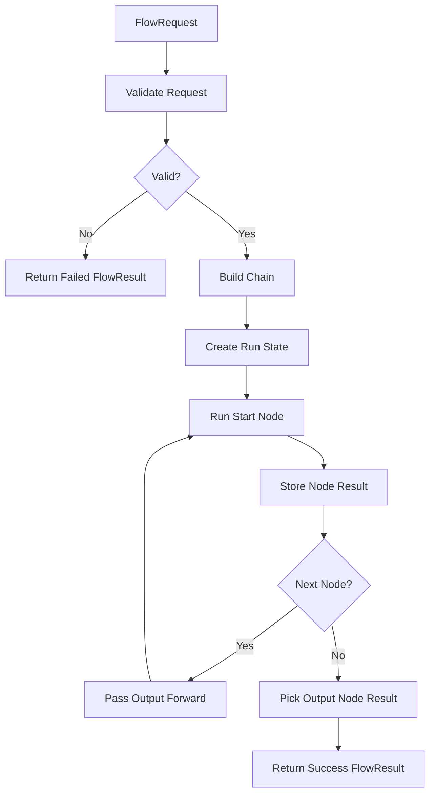

## 2. Flow Input Shape

```ts
type FlowRequest = {
  input: unknown;
  nodes: FlowNode[];
  edges: FlowEdge[];
  output: string;
};
```

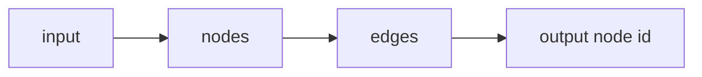

## 3. Validation Algorithm

Validation runs before any node handler.

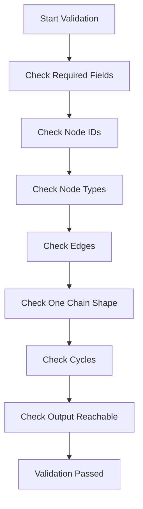

### Validation Rejects

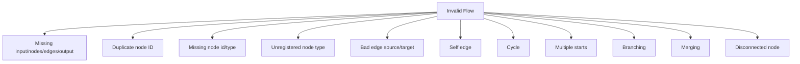

## 4. Chain Building

V1 accepts one connected chain.

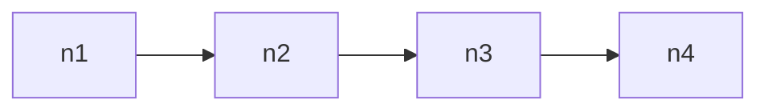

V1 rejects branching:

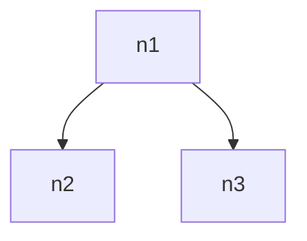

V1 rejects merging:

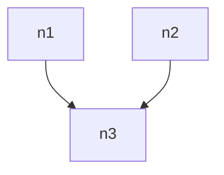

V1 rejects disconnected nodes:

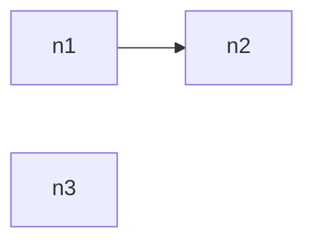

## 5. Execution Algorithm

Each node receives:

```text
previous output + node config + context
```

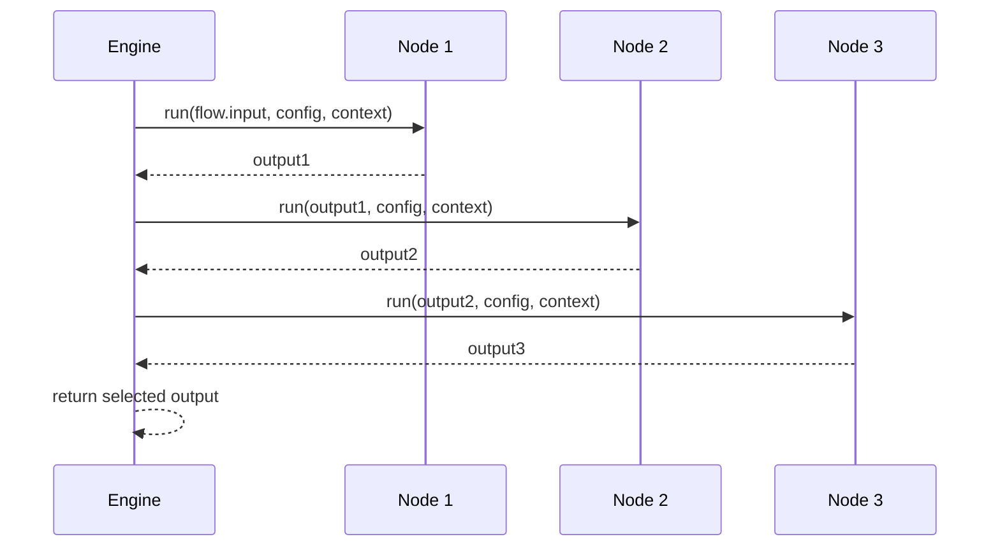

## 6. Input Passing Rules

### Single Node

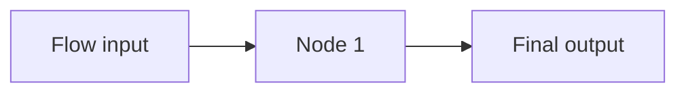

```text
Node 1 input = FlowRequest.input
Final output = Node 1 output
```

### Linear Chain

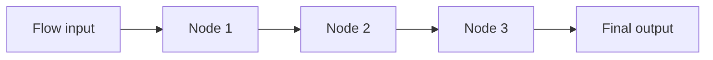

```text
Node 1 input = FlowRequest.input
Node 2 input = Node 1 output
Node 3 input = Node 2 output
Final output = selected output node output
```

### Output Node Before End

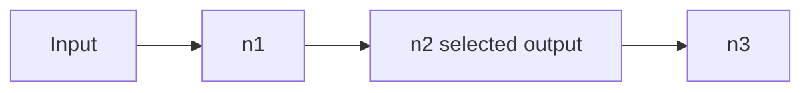

```text
Returned output = n2 output
```

## 7. Major Input Use Cases

### Data Transform

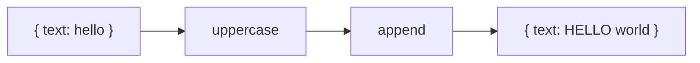

Handled as:

```text
object -> object -> object
```

### API / Tool Chain

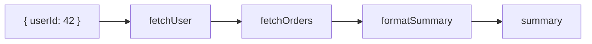

Handled as:

```text
request input -> API result -> API result -> formatted output
```

### Crawler / Parser

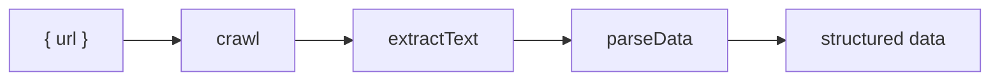

Handled as:

```text
URL input -> HTML/text -> cleaned text -> structured output
```

### Database Flow

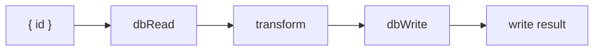

Handled as:

```text
query input -> database row -> transformed row -> write result
```

### AI / Agent Step

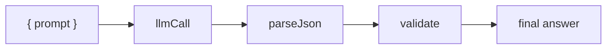

Handled as:

```text
prompt -> model response -> parsed object -> validated output
```

### File Processing

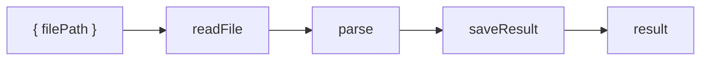

Handled as:

```text
file reference -> file content -> parsed data -> saved result
```

## 8. Special Input Values

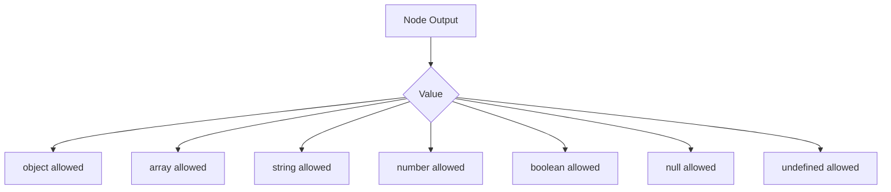

Rules:

- `null` is allowed and passed to the next node.
- `undefined` is allowed and passed to the next node.
- missing `config` becomes `undefined`.
- missing top-level flow `input` is a validation error.

## 9. Error Algorithm

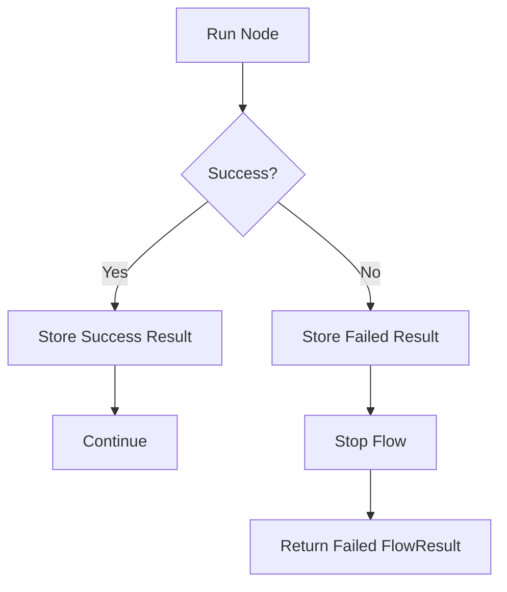

Failure result:

```ts
{
  success: false,
  output: undefined,
  nodeResults,
  error
}
```

## 10. State Tracking

```mermaid
flowchart LR
    A[pending] --> B[running]
    B --> C[success]
    B --> D[failed]
```

Each node result stores:

```text
nodeId
nodeType
status
input
output
error
```

## 11. Algorithm Done For V1

```mermaid
flowchart TD
    A[V1 Ready] --> B[Validation]
    A --> C[Chain Building]
    A --> D[Input Passing]
    A --> E[Execution]
    A --> F[State Tracking]
    A --> G[Error Handling]
    A --> H[Major Test Cases]
```

## 12. Future Algorithms

Not part of v1:

```mermaid
flowchart TD
    A[Future] --> B[Branching]
    A --> C[Merging]
    A --> D[Retries]
    A --> E[Timeouts]
    A --> F[Events]
    A --> G[Persistence]
    A --> H[Visual Editor]
```

## Related Docs

- [Project Reference](PROJECT_REFERENCE.md)
- [Logic Design](LOGIC_DESIGN.md)
- [API Design](API_DESIGN.md)
- [Test Plan](TEST_PLAN.md)
