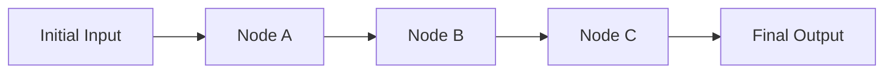
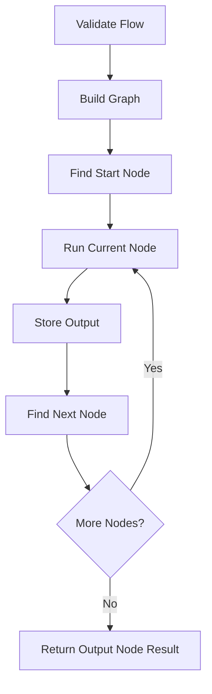

# Logic Design

[Docs Home](README.md) | [Previous: Algorithm Reference](ALGORITHM_REFERENCE.md) | [Next: API Design](API_DESIGN.md)

This document defines the first working logic for Nodrica.

## Aim

Nodrica runs an input-defined node flow.

```text
initial input -> node -> node -> node -> selected output
```

The host app provides the real node behavior. Nodrica only controls flow execution.

## V1 Execution Model

Version 1 should support:

- one input object for the whole flow
- custom registered node types
- single-node flows
- linear flows
- graph validation to reject bad edges and cycles
- final output selection by node ID
- clean validation and execution errors

Version 1 should avoid:

- retry
- timeout
- persistence
- visual builder
- distributed workers
- built-in DB/API/AI/crawler nodes
- complex input mapping
- multi-parent node input merging
- parallel branch execution

## Flow Rules

```text
FlowRequest
  input: initial data
  nodes: node instances to run
  edges: connections between node instances
  output: node ID whose output becomes final output
```

Rules:

- every node must have a unique `id`
- every node must have a registered `type`
- every edge `from` must point to an existing node
- every edge `to` must point to an existing node
- `output` must point to an existing node
- cycles are not allowed in v1
- a single-node flow may have an empty `edges` array

V1 executable flow shape should stay simple:

```text
single node:
input -> n1

linear:
input -> n1 -> n2 -> n3
```

The graph utilities should be written cleanly, but full branching behavior can come later.

## V1 Strict Decisions

These decisions remove ambiguity for implementation.

| Case | V1 Decision |
|---|---|
| `run()` validation failure | Return `FlowResult` with `success: false`; do not throw by default. |
| `run()` node execution failure | Return `FlowResult` with `success: false`; include node ID and type. |
| Node handler throws | Stop the flow and return failed result. |
| Node handler rejects promise | Stop the flow and return failed result. |
| Node handler returns `undefined` | Allow it. Pass `undefined` to the next node. |
| Node handler returns `null` | Allow it. Pass `null` to the next node. |
| Node config omitted | Pass `undefined` as config. |
| Flow input omitted | Treat as validation error. |
| Node missing `id` | Validation error. |
| Node missing `type` | Validation error. |
| Edge missing `from` or `to` | Validation error. |
| Self-edge, like `n1 -> n1` | Validation error. |
| Multiple start nodes | Reject in v1. Add branching later. |
| Multiple outgoing edges from one node | Reject in v1. Add branching later. |
| Multiple incoming edges to one node | Reject in v1. Add merging later. |
| Disconnected node not used by output chain | Reject in v1. |
| Output node unreachable from start | Reject in v1. |
| Output node before the last node | Allow only if it is still part of the chain; return that node's output. |
| Execution order | Must follow edge order from start node to next node. |
| `runId` | Generate once per `run()` call and pass to every node context. |
| Built-in nodes | None in v1 except test/example nodes outside the core. |

## Input Passing

For v1, keep input passing simple:

```text
start node receives FlowRequest.input
next node receives previous node output
final result is output of FlowRequest.output node
```

For a linear flow:



For later branching support, a node with multiple parents can receive a parent output map:

```ts
{
  parents: {
    nodeA: outputFromA,
    nodeB: outputFromB
  }
}
```

Do not implement complex data mapping in v1 unless needed.

## Execution Order

The v1 executor should:

1. validate the flow
2. build dependency maps
3. find the start node with no incoming edges
4. run nodes in order
5. store each node result
6. move to the next connected node
7. return the selected output node result



## Node Status

Use a small status model:

```ts
type NodeStatus =
  | "pending"
  | "running"
  | "success"
  | "failed"
  | "skipped";
```

V1 may not need `skipped`, but reserve it for later conditional edges.

## Flow Result

Successful result:

```ts
{
  success: true,
  output: unknown,
  nodeResults: Record<string, NodeResult>
}
```

Failed result:

```ts
{
  success: false,
  output: undefined,
  nodeResults: Record<string, NodeResult>,
  error: NodeFlowError
}
```

## Error Behavior

Validation errors happen before any node runs.

Execution errors happen while running a node.

Rules:

- if validation fails, no node should run
- if a node fails, the flow should stop in v1
- failed result should include failed node ID and node type
- successful previous node outputs should remain in `nodeResults`

## Core Boundary

Nodrica should never include hard-coded node behavior.

```text
Nodrica core:
  validation
  graph logic
  node execution
  state tracking
  result building

Host app:
  DB node
  API node
  crawler node
  AI node
  file node
  any custom node
```

## Related Docs

- [Algorithm Reference](ALGORITHM_REFERENCE.md)
- [API Design](API_DESIGN.md)
- [Test Plan](TEST_PLAN.md)
- [Implementation Checklist](IMPLEMENTATION_CHECKLIST.md)
