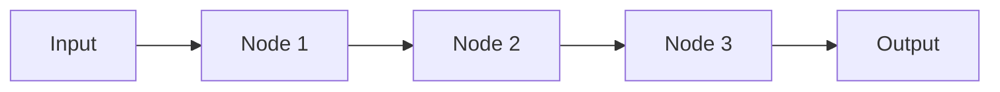
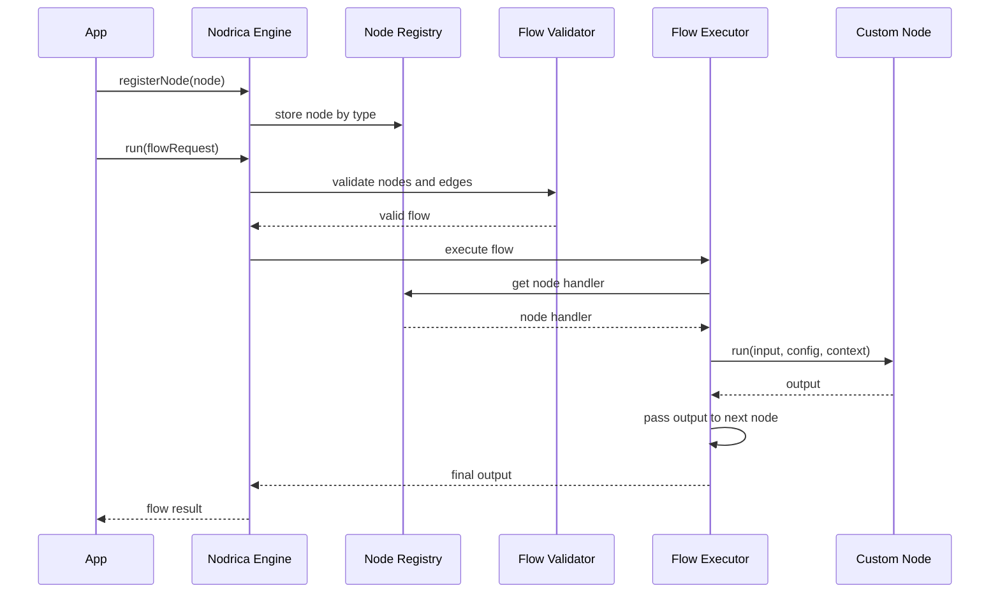
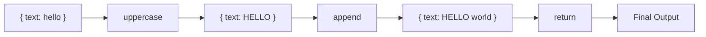

# Nodrica Project Reference

[Docs Home](README.md) | [Next: Algorithm Reference](ALGORITHM_REFERENCE.md)

Project name: **Nodrica**  
Package idea: **generic node-flow engine for JavaScript/TypeScript apps**

## 1. One-Line Definition

Nodrica is a lightweight TypeScript package that lets an app define nodes, connect them as a flow, send input through the flow, and receive the final output.



## 2. Core Concept

The engine does not know what a node does.

A node can be:

- database operation
- API call
- crawler
- file operation
- AI call
- package wrapper
- data transformer
- validation step
- custom business function

The engine only manages:

- node registration
- flow validation
- connection order
- input/output passing
- execution state
- final result

## 3. What The Package Is

```text
Other app installs package
Other app registers custom nodes
Other app sends a flow request
Nodrica runs the connected nodes
Nodrica returns the final result
```

## 4. What The Package Is Not

Nodrica is not:

- a full automation platform
- a visual builder
- a job assistant app
- a database package
- an AI framework
- a crawler framework
- a queue system

Those can be built as nodes by the app using the package.

## 5. Main Runtime Flow



## 6. Public API Goal

```ts
import { NodeFlowEngine } from "nodrica";

const engine = new NodeFlowEngine();

engine.registerNode({
  type: "uppercase",
  async run(input) {
    const current = input as { text: string };

    return {
      text: current.text.toUpperCase()
    };
  }
});

const result = await engine.run({
  input: { text: "hello" },
  nodes: [
    { id: "n1", type: "uppercase" }
  ],
  edges: [],
  output: "n1"
});
```

## 7. Flow Request Shape

```ts
type FlowRequest = {
  input: unknown;
  nodes: FlowNode[];
  edges: FlowEdge[];
  output: string;
};

type FlowNode = {
  id: string;
  type: string;
  config?: unknown;
};

type FlowEdge = {
  from: string;
  to: string;
  condition?: string;
};
```

## 8. Node Contract

Every node follows one simple rule:

```text
input + config + context -> output
```

```ts
type NodeDefinition = {
  type: string;
  run: NodeHandler;
};

type NodeHandler = (
  input: unknown,
  config: unknown,
  context: NodeContext
) => Promise<unknown> | unknown;
```

## 9. Example

```text
Input:
{ text: "hello" }

Flow:
uppercase -> append -> return

Output:
{ text: "HELLO world" }
```



## 10. Core Components

| Component | Purpose |
|---|---|
| `NodeFlowEngine` | Main public class. Registers nodes and runs flows. |
| `NodeRegistry` | Stores node definitions by type. |
| `FlowValidator` | Validates nodes, edges, output node, and cycles. |
| `FlowExecutor` | Runs nodes in the correct order. |
| `NodeExecutor` | Executes one node safely. |
| `ConnectionResolver` | Finds next nodes after one node completes. |
| `ExecutionState` | Stores node input, output, status, and errors. |
| `ResultBuilder` | Builds the final response. |

## 11. Planned Folder Structure

```text
src/
  index.ts

  core/
    NodeFlowEngine.ts
    NodeRegistry.ts
    FlowValidator.ts
    FlowExecutor.ts
    NodeExecutor.ts
    ConnectionResolver.ts
    ExecutionState.ts
    ResultBuilder.ts

  types/
    FlowRequest.ts
    FlowNode.ts
    FlowEdge.ts
    FlowResult.ts
    NodeDefinition.ts
    NodeHandler.ts
    NodeContext.ts
    ExecutionStatus.ts

  errors/
    NodeFlowError.ts
    ValidationError.ts
    NodeExecutionError.ts

  utils/
    topologicalSort.ts
    cycleDetection.ts
    ids.ts

tests/
  node-registry.test.ts
  flow-validator.test.ts
  flow-executor.test.ts
  node-executor.test.ts
  integration.test.ts
```

## 12. Minimum Test Cases

The first implementation should cover:

- runs a single-node flow
- runs a linear multi-node flow
- passes output from one node to the next
- returns output from the selected final node
- rejects duplicate node IDs
- rejects missing node types
- rejects unregistered node types
- rejects edges pointing to missing nodes
- rejects cyclic flows
- supports async node handlers
- captures node execution failure
- stops cleanly when a node fails
- handles empty edges for single-node flow
- passes node config into the node handler
- passes node context into the node handler
- rejects unreachable output node

## 13. V1 Logic Decisions

- validation must happen before execution
- validation failure must run zero nodes
- `run()` should return failed `FlowResult` instead of throwing by default
- start nodes receive the initial flow input
- a linear next node receives previous node output
- v1 execution should focus on single-node and linear flows
- v1 should reject multiple starts, multiple outgoing edges, multiple incoming edges, and disconnected nodes
- branching and multi-parent merging are future features
- if a node fails, the flow stops in v1
- `undefined` and `null` node outputs are allowed
- missing node config should pass `undefined`
- one `runId` should be shared by all nodes in a single run
- the final `output` field decides which node result is returned
- core package must not ship hard-coded DB, AI, crawler, browser, or app-specific nodes

## 14. Future Features

Add later, not in the first version:

- retry policy
- timeout policy
- conditional edges
- parallel branches
- input/output mapping
- event emitter
- pause/resume
- needs-input state
- visual editor support

## 15. Design Rule

Keep the core small.

```text
Core engine = flow execution infrastructure
External app = real node behavior
```

The engine should never include hard-coded DB, AI, crawler, browser, email, or business-specific logic.

## 16. Detailed Docs

- [Docs Home](README.md)
- [Algorithm Reference](ALGORITHM_REFERENCE.md)
- [API Design](API_DESIGN.md)
- [Logic Design](LOGIC_DESIGN.md)
- [Test Plan](TEST_PLAN.md)
- [Implementation Checklist](IMPLEMENTATION_CHECKLIST.md)
