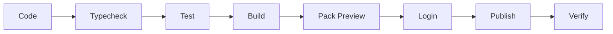
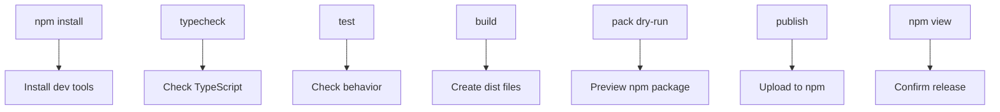
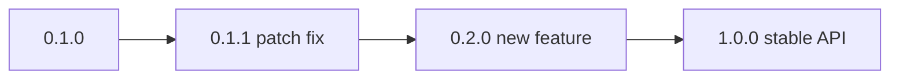
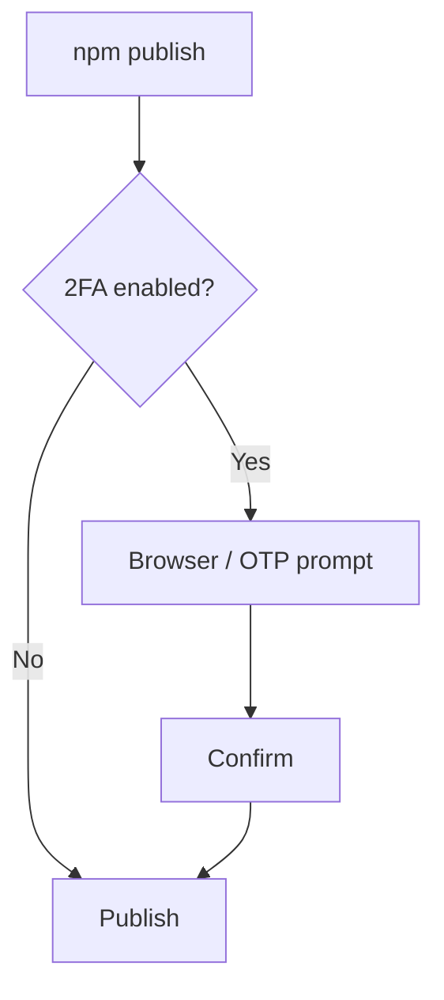

# Publishing

[Docs Home](README.md) | [V1 Validation Report](VALIDATION_REPORT.md)

Short guide for releasing Nodrica to npm.

## Release Flow



## Commands

```bash
npm install
npm run typecheck
npm test
npm run build
npm pack --dry-run
npm login
npm publish --access public
npm view nodrica
```

## What Each Step Means



## Version Flow



Use:

```bash
npm version patch
npm publish --access public
```

## 2FA / OTP



If npm asks for OTP:

```bash
npm publish --access public --otp=123456
```

Replace `123456` with the current 2FA code.

## Current Release

```text
Package: nodrica
Version: 0.1.0
Status: published
Access: public
Install: npm install nodrica
```

## Checklist

- [x] package name available
- [x] tests pass
- [x] build passes
- [x] pack preview checked
- [x] npm public publish completed
- [x] `npm view nodrica` confirmed

