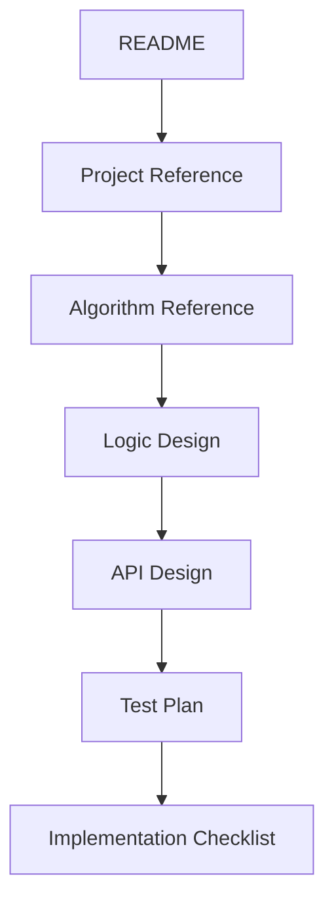
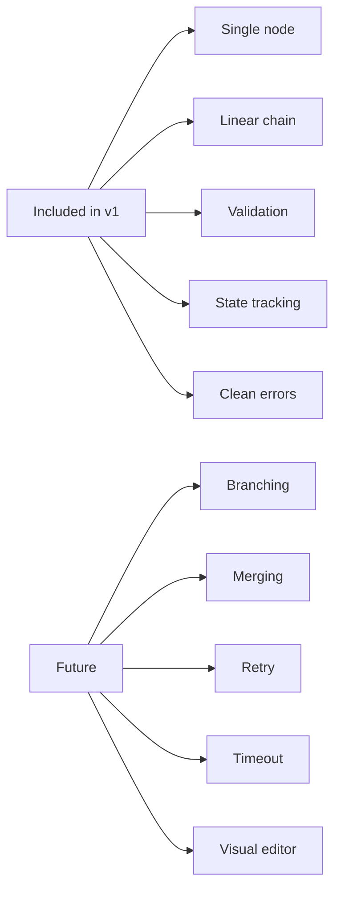

# Nodrica Documentation

Use this page as the map for the project docs.

[Back to Root README](../README.md)



## Read In This Order

| Step | Document | Use It For |
|---|---|---|
| 0 | [Root README](../README.md) | Start here for the short GitHub overview. |
| 1 | [Project Reference](PROJECT_REFERENCE.md) | Understand the aim, boundary, components, and v1 scope. |
| 2 | [Algorithm Reference](ALGORITHM_REFERENCE.md) | See the main algorithms and input-handling diagrams. |
| 3 | [Logic Design](LOGIC_DESIGN.md) | Check strict v1 rules and edge-case decisions. |
| 4 | [API Design](API_DESIGN.md) | Review the public package API and TypeScript shapes. |
| 5 | [Test Plan](TEST_PLAN.md) | See the expected behavior tests. |
| 6 | [Implementation Checklist](IMPLEMENTATION_CHECKLIST.md) | Build the package in the right order. |

## Project Aim

```text
register custom nodes
validate one connected chain
run input through nodes in order
return selected final output
```

## V1 Boundary



## Main Docs

- [Project Reference](PROJECT_REFERENCE.md)
- [Algorithm Reference](ALGORITHM_REFERENCE.md)
- [Logic Design](LOGIC_DESIGN.md)
- [API Design](API_DESIGN.md)
- [Test Plan](TEST_PLAN.md)
- [Implementation Checklist](IMPLEMENTATION_CHECKLIST.md)
